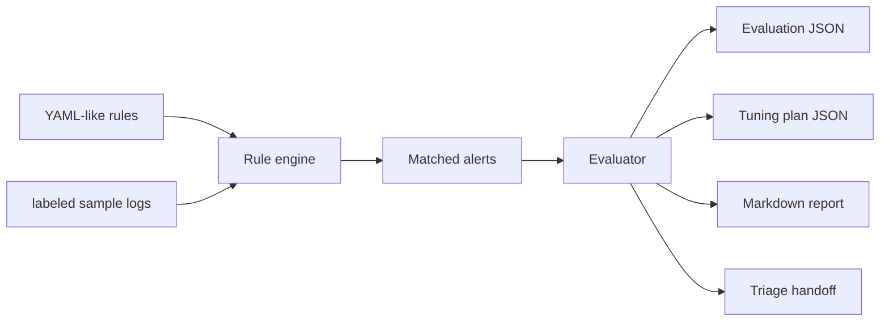

# Architecture

Rule Tuning Lab is a defensive SOC workflow lab for measuring alert noise and improving detection rules from labeled sample logs.

## Current MVP

- Loads simple YAML-like detection rules.
- Runs rules against safe labeled logs.
- Measures true positives, false positives, false positive rate, precision, and noise grade.
- Produces suggestions, summary, tuning plan, report, and triage artifacts.

## Future Product Shape

- Before/after simulations for proposed rule changes.
- Suppression and allowlist condition examples.
- Rule-change history with reviewer notes.
